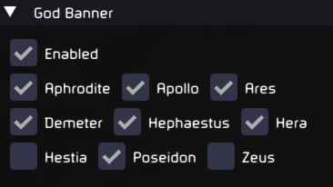

## God Banner

Allows you to ban certain gods from appearing in runs. Inspired by and uses some code from [The One God](https://thunderstore.io/c/hades-ii/p/zannc/The_One_God/) by [@dwbl](https://github.com/zanncdwbl).

## Installation

Use r2modman by ebkr from [Thunderstore](https://thunderstore.io/package/ebkr/r2modman/) or [GitHub](https://github.com/ebkr/r2modmanPlus/releases/latest).

While the mod has been tested decently well it is recommended to backup your save from `%USERPROFILE%\Saved Games\Hades II\Profile*.sav` in case there are issues.

## Configuration

Configure the mod using ImGui (Default imgui toggle keybind: INSERT). A ✅ means the god is banned. If the ImGui interface seems unresponsive try disabling V-sync and external frame limiters if enabled.

## Issues

Report any issues [here](https://github.com/adi1998/GodBanner/issues) or on [Discord](https://discord.gg/bKvJTAJj)